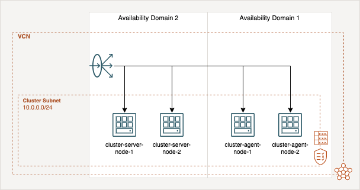

#  Free K3s Cluster the Oracle Cloud Infrastructure

The motivation of this project is to provide a K3s cluster with four nodes fully automatically, which is composed only of always free infrastructure resources. The deployment will be done Terraform and the user-data scripts which installs K3s automatically and build up the cluster.

## Architecture
The cluster infrastructure based on four nodes, two server- and two agent-nodes for your workload. A load balancer which is distributes the traffic to your nodes on port 443. The server-nodes are at the availability domain 2 (AD-2) and the agent node are created in AD-1. The cluster use the storage solution [Longhorn](https://longhorn.io/), which will use the block storages of the OCI instances and shares the Kubernetes volumes between them. The following diagram give an overview of the infrastructure.



## Configuration
First of all, you need to setup some environment variables which are needed by the OCI Terraform provider.
```
export TF_VAR_compartment_id="<COMPARTMENT_ID>"
export TF_VAR_region="<REGION_NAME>"
export TF_VAR_tenancy_ocid="<TENANCY_OICD>"
export TF_VAR_user_ocid="<USER_OICD>"
export TF_VAR_fingerprint="<RSA_FINGERPRINT>"
export TF_VAR_private_key_path="<PATH_TO_YOUR_PRIVATE_KEY>"
export TF_VAR_ssh_authorized_keys='["<SSH_PUBLIC_KEY>"]'
```

## Deployment
The deployment is a straight forwards process. First, start with a Terraform init:
```
terraform init
```
Second, you have to create a Terraform plan by this command:
```
terraform plan -out .tfplan
```
And last apply the plan:
```
terraform apply ".tfplan"
```

After a couple minutes the OCI instances are created and the Cluster is up and running. And are able to connect via SSH to your Server-node-1 to get the kube-config.
```
scp rancher@<SERVER_NODE_1_PUBLIC_IP>:/etc/rancher/k3s/k3s.yaml ~/.kube/config
```

Now you can use ```kubectl``` to manange your cluster.

## Checks
Check the cluster:
```
kubectl get nodes
```
Get the storage Longhorn storageclass:
```
kubectl get storageclass
```

## To Do's
- Terraform Loadbalancer deployment